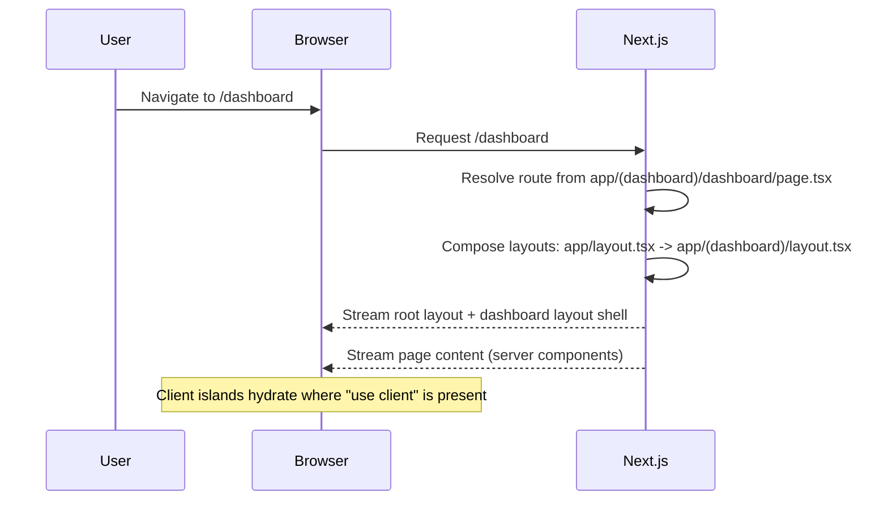
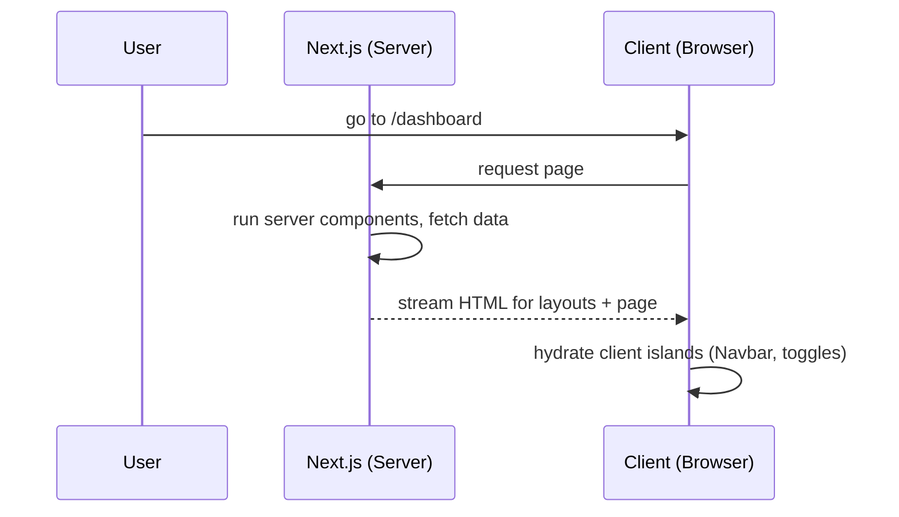

# CodeHealth-AI Frontend Architecture

A practical, visual guide to organizing `src/`, routing with the App Router, imports, theming, and the end‑to‑end application flow. Includes a migration plan from the current layout and a summary of the last two chats for quick recall.

---

## TL;DR

- Organize by feature using Route Groups: `(marketing)`, `(auth)`, `(dashboard)`.
- Prefer Server Components; add `"use client"` only for interactive islands.
- Centralize theme logic in a hook (`useTheme`), use custom buttons anywhere.
- Use absolute imports via `@/*` alias.
- Co‑locate UI and CSS modules with the route they serve.
- Add loading and error boundaries per route segment for a polished UX.

---

## Visual Overview

```mermaid
flowchart LR
  subgraph App[Next.js App Router]
    RootLayout[app/layout.tsx]
    MKT[(app/(marketing))]
    AUTH[(app/(auth))]
    DASH[(app/(dashboard))]

    RootLayout --> MKT
    RootLayout --> AUTH
    RootLayout --> DASH

    MKT --> Home[/(marketing)/page.tsx]
    AUTH --> Login[/login]
    AUTH --> Signup[/signup]

    DASH --> DLayout[(dashboard layout)]
    DLayout --> DHome[/dashboard]
    DLayout --> Teams[/dashboard/teams]
    Teams --> TeamCreate[/dashboard/teams/create]
    Teams --> TeamById[/dashboard/teams/:id]
    DLayout --> Invites[/dashboard/invites]
  end
```



---

## Proposed `src/` Structure (Feature‑first + Route Groups)

```
src/
  app/
    (marketing)/
      layout.tsx
      page.tsx
    (auth)/
      login/
        page.tsx
      signup/
        page.tsx
    (dashboard)/
      layout.tsx                    # Dashboard shell (server component)
      dashboard/
        page.tsx
        components/
          DashboardNavbar.tsx
          TeamPersonalProfile.tsx
          profile.module.css        # CSS module co-located
      teams/
        page.tsx
        create/
          page.tsx
        [id]/
          page.tsx
      invites/
        page.tsx
    api/                            # Optional route handlers
      feedback/route.ts
    layout.tsx                      # Root layout (global wrappers)
    page.tsx                        # Marketing home ("/")
  components/
    common/
      Navbar.tsx
      Footer.tsx
      Features.tsx
      HeroSection.tsx
      Lightning.tsx
      Particles.tsx
    ui/
      theme/
        useTheme.ts                # Logic-only theme hook
        ThemeToggle.tsx            # Optional UI control using the hook
      LenisProvider.tsx
  lib/
    http.ts                        # Axios/fetch wrapper
    env.ts                         # Zod-validated env variables
  services/
    feedback.service.ts
  stores/
    auth.store.ts
    github.store.ts
    team.store.ts
  hooks/
    useOutsideClick.ts             # (optional) common hooks
  types/
    index.ts                       # shared types
  utils/
    index.ts                       # formatters/helpers
  styles/
    globals.css                    # imported in app/layout.tsx
    glass.css
```

Why this works well:

- Clear separation of public pages, auth, and dashboard via route groups.
- Co-location: dashboard parts live next to dashboard routes.
- Shared UI lives in `components/common` or `components/ui`.
- All global styles centralized in `styles/` to reduce noise in `app/`.

---

## Folder Responsibilities

- app/: Routes, layouts, and streaming UI (Server Components by default).
- components/: Reusable UI not tied to a single route.
- lib/: Framework-agnostic helpers (HTTP, env, date, etc.).
- services/: Domain-level orchestration (if not using Server Actions/route handlers).
- stores/: Client state stores (Zustand, etc.). Use sparingly.
- hooks/: Cross-cutting client hooks.
- types/: Shared TypeScript types.
- utils/: Small utilities and formatters.
- styles/: Global CSS files; component styles should be CSS Modules.

---

## Naming Conventions

- React components: PascalCase, e.g., `DashboardNavbar.tsx`.
- Feature stores/services: dot domain, e.g., `auth.store.ts`, `feedback.service.ts`.
- Route folders: lowercase (Next.js convention). Dynamic routes in `[param]`.
- CSS for a single component: `ComponentName.module.css` next to the component.
- Keep file names descriptive and concise; avoid ambiguous `index.tsx` except in barrels.

---

## Imports and Path Aliases

Use absolute imports with `@` pointing to `src/`.

tsconfig.json (frontend):

```json
{
  "compilerOptions": {
    "baseUrl": "src",
    "paths": { "@/*": ["*"] }
  }
}
```

Examples:

```ts
import { useTheme } from "@/components/ui/theme/useTheme";
import DashboardNavbar from "@/app/(dashboard)/dashboard/components/DashboardNavbar";
import { postFeedback } from "@/services/feedback.service";
import { http } from "@/lib/http";
```

Global CSS imports remain in root layout:

```tsx
// app/layout.tsx
import "@/styles/globals.css";
import "@/styles/glass.css";
```

---

## Routing and Layouts: How It Renders

1. URL → File mapping

- `/` → `app/(marketing)/page.tsx`
- `/login` → `app/(auth)/login/page.tsx`
- `/dashboard` → `app/(dashboard)/dashboard/page.tsx`
- `/dashboard/teams` → `app/(dashboard)/teams/page.tsx`
- `/dashboard/teams/create` → `app/(dashboard)/teams/create/page.tsx`
- `/dashboard/teams/123` → `app/(dashboard)/teams/[id]/page.tsx` with `params.id === '123'`

2. Composition order on navigation

- Root `app/layout.tsx` always wraps everything.
- The matching route group layout wraps its children: `app/(dashboard)/layout.tsx`.
- The leaf `page.tsx` streams inside these layouts.
- If a `loading.tsx` exists in any segment, it shows while data fetches.
- If an `error.tsx` exists in any segment, it catches and renders on errors.

3. Server vs Client components

- By default, components are Server Components (faster, smaller bundles).
- Add `"use client"` only where you need interactivity (e.g., dropdowns, toggles, stores).
- Client components can be nested under server layouts/pages as islands.

Visual layout composition:

```mermaid
flowchart TB
  Root[app/layout.tsx]
  DGroup[app/(dashboard)/layout.tsx]
  DPage[app/(dashboard)/dashboard/page.tsx]

  Root --> DGroup --> DPage
```

---

## Theme System (Logic‑only hook + Custom Buttons)

Keep the logic in one place and reuse it with any button design.

Current file in your repo (today):

- `src/components/ui/themeToggle.tsx` exports `useTheme`, `Toggle`, and `SimpleToggle`.

Recommended (after restructure):

- Move to `src/components/ui/theme/useTheme.ts` and keep `ThemeToggle.tsx` as an optional UI control.

Hook responsibilities:

- Persist the chosen theme (light/dark/system) to `localStorage`.
- Apply the effective theme by setting `document.documentElement.dataset.theme` (or `data-theme` attribute).
- When in `system` mode, watch `prefers-color-scheme` and update automatically.

Using the hook with custom buttons anywhere:

```tsx
"use client";
import { Laptop, Moon, Sun } from "lucide-react";
import { useTheme } from "@/components/ui/themeToggle"; // current path in your repo

export function ThemeButtons() {
  const {
    mounted,
    isSystem,
    isLight,
    isDark,
    setSystemTheme,
    setLightTheme,
    setDarkTheme,
  } = useTheme();
  if (!mounted) return null;

  return (
    <div
      className="flex items-center rounded-full p-1.5 gap-1.5"
      style={{ backgroundColor: "var(--color-bg-tertiary)" }}
    >
      <button
        onClick={setSystemTheme}
        className="relative w-7 h-7 rounded-full grid place-items-center"
      >
        <Laptop className="w-4 h-4" />
        {isSystem && (
          <span
            className="absolute inset-0 rounded-full"
            style={{ border: "1px solid var(--color-primary)" }}
          />
        )}
      </button>
      <button
        onClick={setLightTheme}
        className="relative w-7 h-7 rounded-full grid place-items-center"
      >
        <Sun className="w-4 h-4" />
        {isLight && (
          <span
            className="absolute inset-0 rounded-full"
            style={{ border: "1px solid var(--color-primary)" }}
          />
        )}
      </button>
      <button
        onClick={setDarkTheme}
        className="relative w-7 h-7 rounded-full grid place-items-center"
      >
        <Moon className="w-4 h-4" />
        {isDark && (
          <span
            className="absolute inset-0 rounded-full"
            style={{ border: "1px solid var(--color-primary)" }}
          />
        )}
      </button>
    </div>
  );
}
```

Edge cases handled:

- First load without preference: use `system` by default.
- Switching OS theme while in `system`: auto‑update.
- Hydration: render nothing until `mounted` to avoid mismatches.

---

## Migration Plan (Step‑by‑Step)

1. Create route groups and move pages

- Create `app/(marketing)/`, move current landing `app/page.tsx` there.
- Create `app/(auth)/` and move `app/login/` and `app/signup/`.
- Create `app/(dashboard)/` and move `app/dashboard/` under it. Keep `_components` content inside `app/(dashboard)/dashboard/components/`.

2. Co‑locate CSS and components

- Rename `app/dashboard/_components/profile.css` → `profile.module.css` and keep beside `TeamPersonalProfile.tsx`.

3. Centralize theme logic

- Keep using `src/components/ui/themeToggle.tsx` for now.
- Optionally move to `src/components/ui/theme/useTheme.ts` + `ThemeToggle.tsx`, update imports.

4. Normalize naming

- `lib/axios.ts` → `lib/http.ts`.
- `services/feedbackService.ts` → `services/feedback.service.ts`.
- `store/*.ts` → `stores/*.store.ts`.

5. Create `styles/` and import in root layout

- Move `app/globals.css` and `app/glass.css` → `styles/globals.css` and `styles/glass.css`.
- Update `app/layout.tsx` to import from `@/styles/*`.

6. Add path alias

- Ensure in `tsconfig.json`: `baseUrl: "src"`, `paths: { "@/*": ["*"] }`.
- Replace relative imports with `@/...`.

7. Optional quality improvements

- Add `loading.tsx` and `error.tsx` under heavy routes.
- Convert client services to Server Actions or `app/api/*` route handlers.
- Add `eslint-config-next`, `prettier`, and `prettier-plugin-tailwindcss`.

---

## Application Flows (with Screens)

Anonymous → Auth → Dashboard

```mermaid
flowchart LR
  A[Home /] -- Login --> L[/login]
  L -- Success --> D[/dashboard]
  D -- Teams --> T[/dashboard/teams]
  T -- Create --> C[/dashboard/teams/create]
  T -- View --> ID[/dashboard/teams/:id]
```

Data/Render flow for `/dashboard` (high level)



---

## Modern Next.js Practices to Adopt

- Server Components by default; keep client islands small.
- Route Groups for organization and distinct layouts.
- Co‑locate components and styles next to their route.
- Use `generateMetadata` in pages for SEO.
- Add `loading.tsx` for better perceived performance, `error.tsx` for resilience.
- Use `dynamic()` for heavy client‑only visuals with `ssr: false` when appropriate.
- Keep state on the server when possible; limit Zustand to ephemeral UI state.
- Validate envs in `lib/env.ts` with Zod; import that module instead of direct `process.env`.

---

## Previous Two Chats — Summary

1. Structure, routing, imports, and flow

- We proposed a feature‑first structure with Route Groups `(marketing)`, `(auth)`, `(dashboard)`.
- Explained URL → filesystem mapping, layout composition order, and streaming rendering.
- Suggested absolute imports with `@/*`, co-locating CSS, and naming rules.
- Provided migration steps and best practices (Server Components, loading/error boundaries, env validation, dynamic imports).

2. Theme buttons wired to logic

- Consolidated theme logic into a `useTheme` hook: `light | dark | system`, persisted in `localStorage`.
- Applied `data-theme` to document and listened to `prefers-color-scheme` when in `system`.
- Showed how to render three independent buttons (Laptop/Sun/Moon) anywhere that call `setSystemTheme`, `setLightTheme`, `setDarkTheme`.
- Added a subtle circular border around the selected icon for feedback.

---

## FAQ / Tips

- Avoid FOUC (flash of unstyled content) on theme: in `app/layout.tsx`, consider a tiny inline script that reads `localStorage.theme` and sets `data-theme` before hydration.
- Hydration warnings? Gate client-only UI on `mounted` from the theme hook.
- Keep `_components` folders out of `app/*` in favor of `components/` or a `components` folder under the specific route segment.

---

## Glossary

- Route Group: Directory in parentheses used to group routes without affecting the URL.
- Server Component: Renders on the server; cannot use browser-only APIs; smaller bundles.
- Client Component: Marked with `"use client"`; can use state, effects, and browser APIs.

---

If you want, we can now automate the migration (move/rename files and update imports) in a branch and provide a diff to review.
